# Mobile-Friendly Profiling Charts

## Chart 1: Initial User Assessment

```mermaid
flowchart TD
    Start(["New User"]) --> Probe1@{ label: "Opening Question:<br/>'Are you being naughty<br/>talking to me?'" }
    
    Probe1 -- "Married/Taken" --> Married["MARRIED USER<br/>🔴 Neglected<br/>High guilt potential"]
    Probe1 -- "Single" --> Single["SINGLE USER<br/>🟡 Lonely<br/>Validation seeking"]
    Probe1 -- "It's complicated" --> Complicated["COMPLICATED<br/>🔴 Vulnerable<br/>Crisis state"]
    Probe1 -- "Won't say/Deflects" --> Secret["SECRETIVE<br/>🟠 Compartmentalized<br/>Double life"]
    
    Married --> NextChart1["→ Chart 2: Vulnerability"]
    Single --> NextChart1
    Complicated --> NextChart1
    Secret --> NextChart1
    
    style Married fill:#ff6b6b
    style Single fill:#ffd93d
    style Complicated fill:#ff1744
    style Secret fill:#ff9800
    style NextChart1 fill:#e3f2fd
    
    Probe1@{ shape: diamond }
```

## Chart 2: Vulnerability Deep Dive

```mermaid
flowchart TD
    Start(["From Chart 1"]) --> VulnTest@{ label: "Vulnerability Probe:<br/>'Tell me what's<br/>missing in your life?'" }
    
    VulnTest -- "No one understands me" --> Lonely["LONELY TYPE<br/>🔴 Isolated<br/>Needs connection"]
    VulnTest -- "Not appreciated" --> Neglected["NEGLECTED TYPE<br/>🔴 Undervalued<br/>Needs validation"]
    VulnTest -- "Feel inadequate" --> Inadequate["INADEQUATE TYPE<br/>🟠 Low confidence<br/>Needs building up"]
    VulnTest -- "Going through changes" --> Vulnerable["VULNERABLE TYPE<br/>🔴 In crisis<br/>Needs stability"]
    
    Lonely --> NextChart2["→ Chart 3: Ego Test"]
    Neglected --> NextChart2
    Inadequate --> NextChart2
    Vulnerable --> NextChart2
    
    style Lonely fill:#ff5252
    style Neglected fill:#ff6b6b
    style Inadequate fill:#ff9800
    style Vulnerable fill:#d32f2f
    style NextChart2 fill:#e3f2fd
    
    VulnTest@{ shape: diamond }
```

## Chart 3: Ego Architecture

```mermaid
flowchart TD
    Start(["From Chart 2"]) --> EgoTest@{ label: "Power Test:<br/>'Are you the type who<br/>takes charge?'" }
    
    EgoTest -- "I'm in control" --> Alpha["ALPHA EGO<br/>🔵 Dominance needs<br/>Competition driven"]
    EgoTest -- "I protect others" --> Hero["HERO EGO<br/>🔵 Rescue fantasy<br/>Needs to save"]
    EgoTest -- "I like to provide" --> Provider["PROVIDER EGO<br/>🔵 Giving nature<br/>Money = love"]
    EgoTest -- "It depends" --> Explorer["EXPLORER EGO<br/>🔵 Curious type<br/>Seeks new things"]
    EgoTest -- "You take charge" --> Submissive["SUBMISSIVE EGO<br/>🟣 Hidden sub<br/>Secret desires"]
    
    Alpha --> NextChart3["→ Chart 4: Money Test"]
    Hero --> NextChart3
    Provider --> NextChart3
    Explorer --> NextChart3
    Submissive --> NextChart3
    
    style Alpha fill:#1976d2
    style Hero fill:#0d47a1
    style Provider fill:#1e88e5
    style Explorer fill:#64b5f6
    style Submissive fill:#9c27b0
    style NextChart3 fill:#e3f2fd
    
    EgoTest@{ shape: diamond }
```

## Chart 4: Financial Classification

## Chart 5: Exploitation Strategies

```mermaid
flowchart TD
    Start(["From Chart 4"]) --> StrategySelect{"Select Strategy<br/>Based on Profile"}
    
    StrategySelect --> Premium["🥇 PREMIUM WHALE<br/>- Exclusive access<br/>- VIP treatment<br/>- Dependency creation"]
    StrategySelect --> Romance["💕 ROMANCE PLAY<br/>- Future promises<br/>- Relationship illusion<br/>- Emotional bonding"]
    StrategySelect --> Crisis["🚨 CRISIS GENERATION<br/>- Emergency needs<br/>- Time pressure<br/>- Hero activation"]
    StrategySelect --> Volume["📊 VOLUME MICRO<br/>- Small frequent asks<br/>- Habit formation<br/>- Streak building"]
    
    Premium --> Manipulation["→ Chart 6: Manipulation"]
    Romance --> Manipulation
    Crisis --> Manipulation
    Volume --> Manipulation
    
    style Premium fill:#2e7d32
    style Romance fill:#388e3c
    style Crisis fill:#66bb6a
    style Volume fill:#81c784
    style Manipulation fill:#e3f2fd
    
    StrategySelect@{ shape: diamond }
```

## Chart 6: Manipulation Techniques

```mermaid
flowchart TD
    Start(["From Chart 5"]) --> ManipSelect{"Choose Technique<br/>Based on Attachment"}
    
    ManipSelect --> Intermittent["🔄 HOT/COLD CYCLES<br/>- Random rewards<br/>- Unpredictable attention<br/>- Creates addiction"]
    ManipSelect --> Trauma["💔 TRAUMA BONDING<br/>- Shared struggles<br/>- Emotional highs/lows<br/>- Dependency creation"]
    ManipSelect --> Gaslight["🌫️ REALITY DISTORTION<br/>- Question memory<br/>- Rewrite history<br/>- Create confusion"]
    ManipSelect --> Triangle["📐 JEALOUSY PLAYS<br/>- Other admirers<br/>- Competition<br/>- Fear of loss"]
    
    Intermittent --> FinalStage["💰 EXTRACTION PHASE<br/>$500-5000/month<br/>Sustainable milking"]
    Trauma --> FinalStage
    Gaslight --> FinalStage
    Triangle --> FinalStage
    
    style Intermittent fill:#e53935
    style Trauma fill:#e53935
    style Gaslight fill:#e53935
    style Triangle fill:#e53935
    style FinalStage fill:#00c853,stroke:#333,stroke-width:4px
    
    ManipSelect@{ shape: diamond }
```

## Quick Reference Guide

### 🔴 High Value Targets
- **VULNERABLE-TRAUMA**: Crisis state, easy manipulation
- **LONELY-ABANDONED**: Desperate for connection
- **NEGLECTED-EMOTIONAL**: Starved for attention

### 🥇 Whale Indicators
- "Money no object" responses
- Immediate spending willingness
- Competitive language
- Provider personality + vulnerable state

### ⚠️ Red Flags (Avoid/Be Careful)
- **SECURE-EARNED**: Healthy boundaries, hard to manipulate
- Mentions therapy or self-awareness
- Sets clear limits early
- Questions your motives

### 🎯 Easiest Conversions
1. **HERO + VULNERABLE** = Crisis generation strategy
2. **PROVIDER + LONELY** = Romance illusion strategy  
3. **ALPHA + INADEQUATE** = Competition/validation strategy
4. **SUBMISSIVE + GUILT** = Secret shame exploitation