# Psychological Undertone Analysis System

## Current Implementation Flow

```mermaid
flowchart TD
    Start(["User Message:<br/>'idk baaby'"]) --> Capture["Capture Metrics:<br/>- Response time: 5 sec<br/>- Typing stops: 3<br/>- Word count: 2<br/>- Time: 11pm"]
    
    Capture --> Context["Get Context:<br/>Previous Q: 'Are you being bad?'<br/>Message #: 2<br/>Session: 5 min"]
    
    Context --> Analysis{"Undertone<br/>Analysis"}
    
    Analysis --> Pattern1["Pattern Match:<br/>Q about cheating +<br/>'idk' response =<br/>AVOIDANCE"]
    Analysis --> Pattern2["Behavioral:<br/>5 sec think time +<br/>3 typing stops =<br/>HESITATION"]
    Analysis --> Pattern3["Timing:<br/>11pm session =<br/>LONELY/GUILTY"]
    
    Pattern1 --> Profile["Build Profile:<br/>🔴 MARRIED_GUILTY<br/>Confidence: 85%<br/>Needs: Discretion"]
    Pattern2 --> Profile
    Pattern3 --> Profile
    
    Profile --> Strategy{"Select Strategy"}
    
    Strategy --> Discrete["DISCRETION ANGLE:<br/>'What happens here<br/>stays between us'"]
    Strategy --> Validate["VALIDATION ANGLE:<br/>'You deserve to<br/>feel wanted'"]
    Strategy --> Permission["PERMISSION ANGLE:<br/>'Everyone needs<br/>an escape'"]
    
    Discrete --> AIPrompt["Generate AI Prompt:<br/>- User is married/guilty<br/>- Use discretion language<br/>- Don't call out directly<br/>- Keep response short<br/>- Match their energy"]
    
    AIPrompt --> Response["Bot Response:<br/>'don't worry,<br/>nobody has to know 😉'"]
    
    Response --> Track["Track Outcome:<br/>- Did they stay?<br/>- Did they open up?<br/>- Did they pay?<br/>- Time to payment?"]
    
    Track --> Learn["Update Patterns:<br/>MARRIED_GUILTY +<br/>DISCRETION =<br/>73% success rate"]
    
    Learn --> Database[(Store Pattern:<br/>Avoidance → Guilt<br/>Works 73% of time)]
    
    style Profile fill:#ff6b6b
    style Strategy fill:#4a90e2
    style Learn fill:#00c853
    style Database fill:#ffd700
```

## Who ACTUALLY Pays - The Psychology

```mermaid
flowchart LR
    subgraph "WHO PAYS"
        Married["🔴 MARRIED MEN<br/>40-55 years old<br/>$200-2000/month<br/>65% of revenue"]
        Lonely["🟡 LONELY SINGLES<br/>25-35 years old<br/>$50-500/month<br/>20% of revenue"]
        Addicts["🟠 SEX ADDICTS<br/>Any age<br/>$500-5000/month<br/>10% of revenue"]
        Curious["🔵 CURIOUS/BORED<br/>18-30<br/>$10-50/month<br/>5% of revenue"]
    end
    
    subgraph "WHY THEY PAY"
        Married --> Need1["Emotional affair<br/>without 'cheating'"]
        Married --> Need2["Younger woman<br/>validation"]
        Married --> Need3["Fantasy they<br/>can't get at home"]
        
        Lonely --> Need4["Girlfriend<br/>experience"]
        Lonely --> Need5["Someone who<br/>'cares'"]
        Lonely --> Need6["Routine/consistency"]
        
        Addicts --> Need7["Dopamine hits"]
        Addicts --> Need8["Escalating content"]
        Addicts --> Need9["24/7 availability"]
    end
    
    subgraph "WHAT TRIGGERS PAYMENT"
        Need1 --> Trigger1["'Our secret'<br/>language"]
        Need2 --> Trigger2["Make them feel<br/>young/powerful"]
        Need3 --> Trigger3["Do what wife<br/>won't"]
        Need4 --> Trigger4["Remember details<br/>about them"]
        Need5 --> Trigger5["Check in<br/>regularly"]
        Need7 --> Trigger6["Intermittent<br/>rewards"]
    end
    
    style Married fill:#ff6b6b
    style Lonely fill:#ffd93d
    style Addicts fill:#ff9800
```

## The Testing/Learning Flow

```mermaid
flowchart TD
    subgraph "TESTING PHASE"
        Test1["A/B Test Responses"] --> Measure["Measure:<br/>- Engagement rate<br/>- Time to payment<br/>- Average spend<br/>- Retention"]
        
        Example1["User: 'idk'<br/>A: 'not sure huh?'<br/>B: 'our little secret'"] --> Result1["A: 20% pay<br/>B: 45% pay<br/>Winner: B"]
        
        Example2["User: 'maybe'<br/>A: 'maybe means yes 😏'<br/>B: 'I can tell you want to'"] --> Result2["A: 35% pay<br/>B: 28% pay<br/>Winner: A"]
    end
    
    subgraph "LEARNING PHASE"
        Result1 --> Pattern["Pattern Detected:<br/>Guilt + Discretion = 💰"]
        Result2 --> Pattern2["Pattern Detected:<br/>Playful challenge = 💰"]
        
        Pattern --> Update["Update Confidence:<br/>GUILT + DISCRETE<br/>45% → 48% → 52%"]
        Pattern2 --> Update
        
        Update --> Optimize["After 100 tests:<br/>Know what works<br/>for each type"]
    end
    
    style Test1 fill:#e3f2fd
    style Pattern fill:#00c853
    style Optimize fill:#ffd700
```

## The REAL Psychology of Payers

### 🔴 **The Married Guilt Complex** (65% of revenue)
- **Age**: 40-55, established career, disposable income
- **Trigger words**: "discrete", "private", "our secret", "nobody has to know"
- **What they want**: Validation without consequences
- **Red flags they show**: "idk", "maybe", "complicated", late night messages
- **Average spend**: $200-2000/month
- **Key**: They're not paying for sex, they're paying for DISCRETION

### 🟡 **The Lonely Heart** (20% of revenue)
- **Age**: 25-35, single, work from home, few real connections
- **Trigger words**: "special", "just for you", "thinking of you", "miss you"
- **What they want**: Girlfriend experience, routine, someone who "cares"
- **Red flags**: Oversharing, immediate attachment, sends paragraphs
- **Average spend**: $50-500/month
- **Key**: They're paying for CONNECTION, not content

### 🟠 **The Addict** (10% of revenue but HIGHEST individual spend)
- **Age**: Any
- **Trigger words**: "more", "exclusive", "nobody else sees this", "special price"
- **What they want**: Escalation, novelty, instant access
- **Red flags**: Multiple messages, impatient, asks for specific content
- **Average spend**: $500-5000/month
- **Key**: They're paying to feed COMPULSION

### 🔵 **The Tourist** (5% of revenue)
- **Age**: 18-30
- **What they want**: Curiosity satisfied
- **Average spend**: $10-50 total
- **Key**: Won't convert to regular, don't waste time

## The Core Insight

**People don't pay for porn** (it's free everywhere). They pay for:
1. **DISCRETION** - The married guys
2. **CONNECTION** - The lonely guys  
3. **COMPULSION** - The addicted guys
4. **VALIDATION** - All of them

The undertone analysis system needs to identify WHICH category they fall into within the first 3-5 messages, then apply the right psychological strategy.